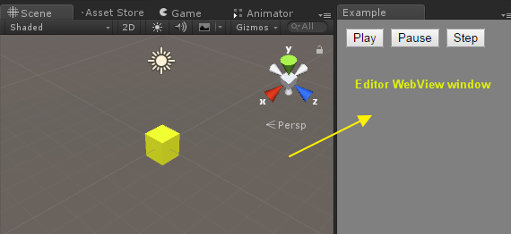

# Unity-WebViewEditorWindow

A simple demonstration of WebView within Unity editor.

  

Original post can be found on [here](http://qiita.com/kyusyukeigo/items/71db22676c6f4743913e), a blog page of @anchan828

**Note**: This is not a way to open webview within an running applicationis. (only for  within Unity editor) If you want to open a webview within any running application, should consider other solutions. See [unity-webview](https://github.com/gree/unity-webview) on its github page for that purpose.
